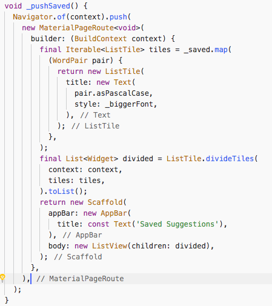

[Write your first Flutter app](https://flutter.dev/docs/get-started/codelab) 예제를 따라 실행해 보았다.  
따라하기다 보니 별다른 문제 없이 잘 실행된다.  
>설치과정은 [여기](https://meganad.tistory.com/category/Flutter)에  

가장먼저 눈에 띠는것은 dart라는 언어이다.  
dart 언어에한 인상은... 좀 애매하다.  
일단 코드의 생김새는 자바스크립트와 비슷한 구조를 하고있다.  
~~자바스크립트를 대체하기 위해 만들었다니 당연한건가?~~  
하지만 조금 만지다 보니 자바와 비슷한것 같다는 생각이 든다.  
개인적인 취향으로는 자바스크립트식 ( )중첩을 별로 좋아하지 않는다.  
눈에 잘 안 들어 온달까... 그런데 vscode에서 코드를 보니...  



flutter 플러그인의 기능인것 같은데 마직막 **)** 뒤에 객체가 표시된다.  
실제 파일에는 저장되지않고 표시만 되는데 덕분에 보기가 좀 수월하다.  

자바스크립트인데 자바스러워서 다소 헤깔리는데 보다보면 익숙해질듯 싶다.  
우선 dart를 익혀야 할것 같진 않고 flutter app을 만들어보다가 필요할때 찾아보면 되듯하다.

```dart
import 'package:flutter/material.dart';
import 'package:english_words/english_words.dart';

void main() => runApp(new MyApp());

class MyApp extends StatelessWidget {
  var primaryColor = Colors.yellow;

  @override
  Widget build(BuildContext context) {
    return new MaterialApp(
      title: 'Startup Name Generator',
      home: RandomWords(),
      theme: new ThemeData(
        primarySwatch:primaryColor,
      ),
    );
  }
}

class RandomWords extends StatefulWidget {
  @override
  RandomWordsState createState() => new RandomWordsState();
}


```