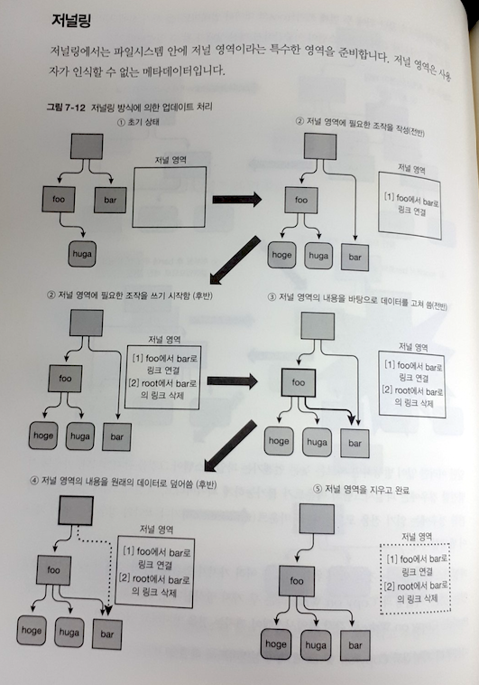

>## **실습과 그림으로 배우는 리눅스 구조**
>#### 개발자가 알아야 하는 OS와 하드웨어의 기초  
>#### 다케우치 사토루 지음, 신준희 옮김 
>#### 한빛미디어  
  

### ***초보자를 대상으로 OS의 기능에 대해 쉽고 자세하게 설명하고 있다.***
---
  
이 책은 linux를 기반으로 OS의 기능과 동작에 대해 아주 쉽게 이해할 수 있도록 구성된 책입니다.
linux의 작동방식에 대한 설명과, 이를 확인해볼 수 있도록 예제코드를 제공하고 있습니다.  
특히 사전지식이 없는 독자들도 OS에서 관리하는 프로세스, 메모리, 파일시스템에 대해 확실히 이해할 수 있도록 차트와 도식을 적극 활용하여 자세히 설명하고 있습니다.  
OS의 동작을 이해하기 위한 좋은 첫걸음이 될 것이라 생각합니다.

이 책의 대상 독자는 **초급 개발자 혹은 비전공자**라고 생각됩니다.  
하지만 실습을 진행하기 위해서는 기초적인 linux 사용법에 대해서는 알고 있어야 합니다.  
최근 데브옵스를 통한 개발방식이 일반화 되어 대부분 linux를 사용하셨을테니 큰 문제가 아닐수도 있지만, linux 경험이 없는 초보 개발자는 실습을 위한 선수지식이 조금 필요합니다.

많은 사람이 프로그래밍을 배우고 사용하고 있지만, 그 토대가 되는 OS에 대해 생각할 기회는 별로 없습니다.  
C언어 이후 대부분의 프로그래밍 언어의 교재가 'Hello, world!'를 작성하는 예제로 시작합니다.  
이후 언어의 문법과 기능들을 배워나가게 되는데, OS의 동작에 대해 알아야 할 경우는 거의 없습니다.  
특히 최근에 개발된 언어일수록 구현하고자 하는 로직에 집중하도록 메모리 관리 등 많은 기능을 언어에 내장하다 보니 더더욱 OS의 기능은 내부에 대해 감춰지게 됩니다.  
프로그램의 성능에 문제가 생기거나, OS가 없는 마이크로컨트롤러를 사용할 때 비로소 OS의 동작에 대해 관심을 가지게 되는 것 같습니다.  
하지만, 최근 데브옵스 형태의 개발이 일반화되면서 특정 부분을 담당하기 보다는 수명주기 전체를 관리해야 하는 경우가 많아지면서 OS와 관련한 문제에 맞닥뜨릴 일이 많아졌습니다.  
이젠 개발자들의 OS에 대한 이해도가 곧 프로그램의 성능을 좌우할 수도 있게 되었습니다.  
OS의 동작과 성능지표에 대해 이해하고 코딩을 한다면 더 나은 개발자가 될 수 있을 것입니다.
