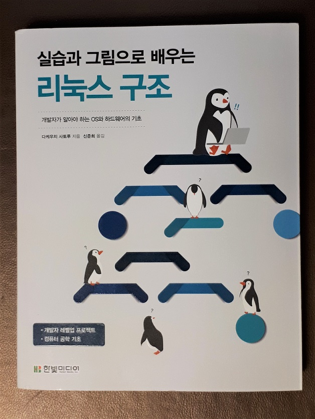

### ***책 리뷰***
>## **모던 웹을 위한 HTML5 CSS 바이블 3판**
>#### 웹 표준을 적용한 480개의 코드로 배우는 웹 페이지 제작의 모든 것  
>#### 윤인성 지음 
>#### 한빛미디어  

{: width="500px"}

### ***HTML5와 CSS3를 사용하여 웹 페이지의 레이아웃을 잡아보자***
---
  
>HTML5 태그 이름은 모두 알고 있는데 이를 어떻게 활용하는지 감을 잡지 못한다면, CSS3 스타일 속성 이름은 모두 알고 있는데 이를 사용해 레이아웃을 어떻게 구성해야 할지 모른다면, HTML5+CSS3를 배웠다고 할 수 있을까요?  
>중요한 것은 HTML5, CSS3를 배우는 것이 아닙니다. 그것을 이용해 웹 페이지를 구현하는 것이 중요합니다. 이 책은 HTML5 표준과 CSS3 표준을 사용하여 웹 페이지를 구현하는 방법을 중심으로 설명합니다.  

책의 뒷표지에 있는 책소개인데, 내 이야기인것 같아 뜨끔했다. 정말 이 책의 정체성을 정확히 표현했다고 생각한다.  

본인도 개발자로 살아가다보니 HTML과 CSS에 대해 꽤 잘 알고 있다고 생각했다. 하지만 내게 전체 화면의 레이아웃을 구성해오라고 한다면 꽤나 막막할 것이다. 개발자들은 퍼블리셔가 만들어준 틀위에서 원하는 기능을 구현하는 경우가 많다보니 대략 알고는 있지만 원하는데로 구성하지 못하는 경우가 많다. 더군다나, Spring이나 Django같은 웹프레임워크를 쓰다보면 레이아웃에 해당하는 부분은 import하여 처리하고 만들고자하는 세부페이지에만 집중하다보니 전체 레이아웃에 대해 더더욱 신경쓰지 않게 된다.  
하지만 적은 인원으로 혹은 혼자서 새로운 프로젝트를 하게 된다면 이런 이는 꽤나 아프게 다가온다. 이럴경우 기존의 틀을 복사해오거나 부트스트랩등을 활용하여 넘어가곤 했는데 이책을 보고나니 조금 부끄러워 졌다. 이렇게 쉽게 할수 있는 거였는데...  

기본적으로 초급자 혹은 HTML과 CSS를 처음 공부하는 분들을 위한 책이라고 밝히고 있다.
하지만 나처럼 HTML과 CSS에 대해 맹목적으로 알고만 있는 분들도 한번 읽어본다면 본인에게 많은 도움이 될것이라 생각한다.  

3개 파트 12개 장으로 구성되어 있는데,  
1