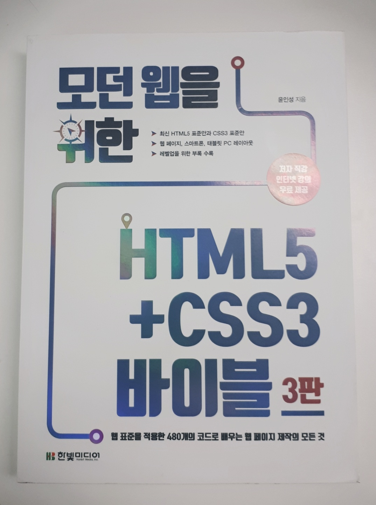

### ***책 리뷰***
>## **모던 웹을 위한 HTML5 CSS 바이블 3판**
>#### 웹 표준을 적용한 480개의 코드로 배우는 웹 페이지 제작의 모든 것  
>#### 윤인성 지음 
>#### 한빛미디어  

{: width="500px"}

### ***HTML5와 CSS3를 사용하여 웹 페이지의 레이아웃을 잡아보자.***
### ***바이블이라기보다는 <u>실전형 입문서</u>이다.***
---
  
>HTML5 태그 이름은 모두 알고 있는데 이를 어떻게 활용하는지 감을 잡지 못한다면, CSS3 스타일 속성 이름은 모두 알고 있는데 이를 사용해 레이아웃을 어떻게 구성해야 할지 모른다면, HTML5+CSS3를 배웠다고 할 수 있을까요?  
>중요한 것은 HTML5, CSS3를 배우는 것이 아닙니다. 그것을 이용해 웹 페이지를 구현하는 것이 중요합니다. 이 책은 HTML5 표준과 CSS3 표준을 사용하여 웹 페이지를 구현하는 방법을 중심으로 설명합니다.  

책의 뒤표지에 있는 책 소개인데, 내 이야기인 것 같아 뜨끔했다. 정말 이 책의 정체성을 정확히 표현했다고 생각한다.  

본인도 개발자로 살아가다 보니 HTML과 CSS에 대해 꽤 잘 알고 있다고 생각했다. 하지만 내게 전체 화면의 레이아웃을 구성해오라고 한다면 꽤 막막할 것이다. 개발자들은 웹 퍼블리셔가 만들어준 틀 위에서 원하는 기능을 구현하는 경우가 많다 보니 대략 알고는 있지만 원하는 데로 구성하지 못하는 경우가 많다. 더군다나, Spring이나 Django같은 웹프레임워크를 쓰다 보면 레이아웃에 해당하는 부분은 import하여 처리하고 만들고자 하는 세부페이지에만 집중하다 보니 전체 레이아웃에 대해 더더욱 신경을 쓰지 않게 된다.  
하지만 적은 인원으로 혹은 혼자서 새로운 프로젝트를 하게 된다면 이런 부분이 꽤 아프게 다가온다. 이럴경우 기존의 틀을 복사해오거나 부트스트랩등을 활용하여 넘어가곤 했는데 이 책을 보고나니 조금 부끄러워졌다. 이렇게 쉽게 할 수 있는 거였는데….

기본적으로 **초급자 혹은 HTML과 CSS를 처음 공부하는 분들을 위한 책**이라고 밝히고 있다.  
하지만 나처럼 HTML과 CSS에 대해 맹목적으로 알고만 있는 분들도 한번 읽어본다면 본인에게 많은 도움이 될 것이라 생각한다.

책의 구성을 보면 1파트는 HTML과 CSS의 기초적인 내용으로, 2파트는 실제 웹 페이지의 레이아웃 구성 실습, 3파트는 CSS의 심화 과정으로 반응형 태그와 부트스트랩을 소개하고 있다. 특히 2파트가 이 책에서 가장 좋은 부분이라고 생각한다. 실제로 조금씩 레이아웃을 쌓아가며 전체 레이아웃을 구성해 가는 과정을 보여준다.

추가로, 저자가 직접 유튜브에 강의를 진행하고 있다. 이 글을 작성하는 시점 기준으로 아직 1파트중 입력태그까지 업로드되어있다. 진도가 좀 늦은 감이 있지만 처음 웹을 공부하려고 하는 분들에게는 많은 도움이 될듯하다.

아쉬운 점이라면 가격 대비 그렇게 많은 내용이 들어있지 않다. 책 제목 *바이블*이고 부피도 상당하지만, 초보자용 따라 하기식 진행이다 보니 내용 자체는 그렇게 많지 않고, 2~3일이면 완독할 수 있을듯한 분량이다.