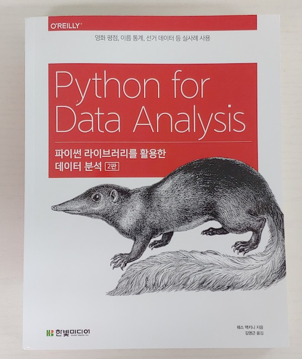
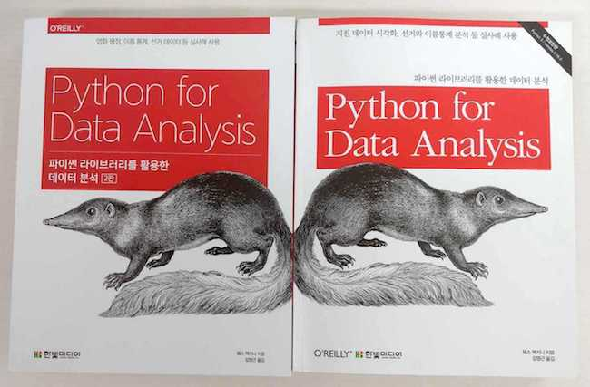
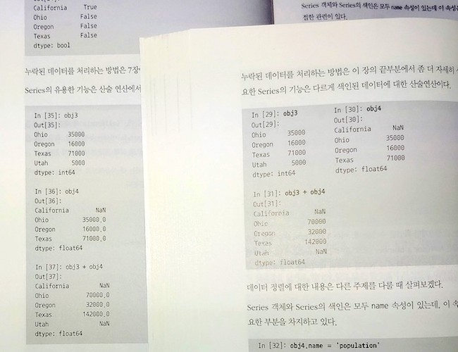

### ***책 리뷰***
>## **파이썬 라이브러리를 활용한 데이터 분석 2판**
>#### 영화 평점, 이름 통계, 선거 데이터 등 실사례 사용 
>#### 웨스 맥키니 지음, 김영근 옮김 
>#### 한빛미디어  

{: width="500px"}

### ***NumPy,Pandas를 익히기 위한 좋은 매뉴얼***
### ***신판에서 새로운 내용을 기대한 사람에게는 다소 아쉬운 구성***

---
  
개인적으로 구판을 가지고 있었는데, 이번에 신판을 리뷰할 기회가 생겨서 다시 한 번 읽어보게 되었다.

우선 이 책의 정체성을 짚고 넘어가야 할 것 같다.  
번역판 제목은 "파이썬 라이브러리를 활용한 데이터 분석(2판)-영화 평점, 이름 통계, 선거 데이터 등 실사례 사용"이다. 또한, 책의 뒤 표지에 보면 "빅데이터 분석에 관한 가장 완벽한 교재"라고 되어있다. 내용을 자세히 안 보고 제목과 표지만 보면 데이터 분석을 알려주는 책 같지만 실제로 읽어보면 내용이 좀 다르게 진행된다.  
원서제목은 ["Python for Data Analysis, 2nd Edition : Data Wrangling with Pandas, NumPy, and IPython"](http://shop.oreilly.com/product/0636920050896.do){:target="_blank"}이다. 부제가 "Data Wrangling"인데, 데이터 분석에 종사하지 않다 보니 정확히 어떻게 번역하는지 모르겠지만 "데이터 전처리"라고 이해하고 있다.  
이 책은 파이썬과 Pandas 등의 도구를 사용하여 데이터를 가공 정제하는 데 초점이 맞추어져 있다. 실사례를 통해 분석업무를 알려주는 책은 아니니 구매하고자 하시는 분들은 꼭 유의하시길 바란다.  

원서제목처럼 Pandas 와 NumPy를 놓고 생각하면 아주 잘 만들어진 책이라고 생각한다.  
번역도 잘 되어있고, 1판에서 넘어오면서 용어들을 다듬어서 더 읽기 좋아졌다. 또한, 구판에서 예제코드를 2단 문서형태로 처리했었는데 이를 1단 문서 형태로 변경하였다. 이전 대비 페이지가 조금 늘어나겠지만, 가독성은 훨씬 좋아졌다.  
파이썬을 처음 사용해보는 데이터분석가 이거나, 어느 정도 파이썬을 다룰 줄 알면서 데이터 분석을 시작하고자 하는 사람을 위한 책이다. R 등 다른 도구로 분석업무를 해온 사람에게는 파이썬을 통해 기존업무를 어떻게 처리할 수 있는지 이해할 수 있으며, 처음으로 데이터 분석에 대해 배우고자 하는 사람들에게는 데이터 분석에 대해 이해하는 데 도움이 되리라 생각한다. 특히, Numpy와 Pandas를 자세히 소개하며 실제 사용할 수 있는 수준으로 발전해 가는 데 많은 도움이 된다. Pandas를 계속 사용할 사람이라면 옆에 두고 수시로 보게 되지 않을까 생각한다.

구판과 비교해 본다면... 혹시 구판을 가지고 있다면 신판은 필요 없을 것 같다.  
내용이 크게 변한 것이 없으며(예제코드도 거의 동일), 좀 더 이해하기 좋도록 배치만 다시 했다. 구판에서 "CH.11-금융 어플리케이션"부분이 삭제되고 "CH.12-고급 Pandas","CH.13-파이썬 모델링 라이브러리"부분이 추가되었는데, 그렇게 많은 분량은 아니다. 특히 CH.13의 경우 따로 공부해야 할 방대한 주제를 20페이지 정도 소개만 한 수준이므로 이를 위해 신판을 또 구매할 필요는 없을 것 같다. 이 외에 IPython(Jupyter) 와 Pandas 변경사항이 조금 반영된 정도이다. 구판*(1판 수정보완판)*이 파이썬2 기준으로 만들어졌지만, 구판에서도 파이썬3 기준으로 실습하는 데 큰 문제가 없었기 때문에 파이썬3이 대세가 된 것을 알게 된 것 이상의 의미는 없는 것 같다.  
2판이 크게 바뀐점이 없다는것은 그만큼 구판의 내용이 좋았다는 의미겠지만, 신판에서 새로운 내용을 기대한 사람에게는 다소 아쉬움이 남는다.
