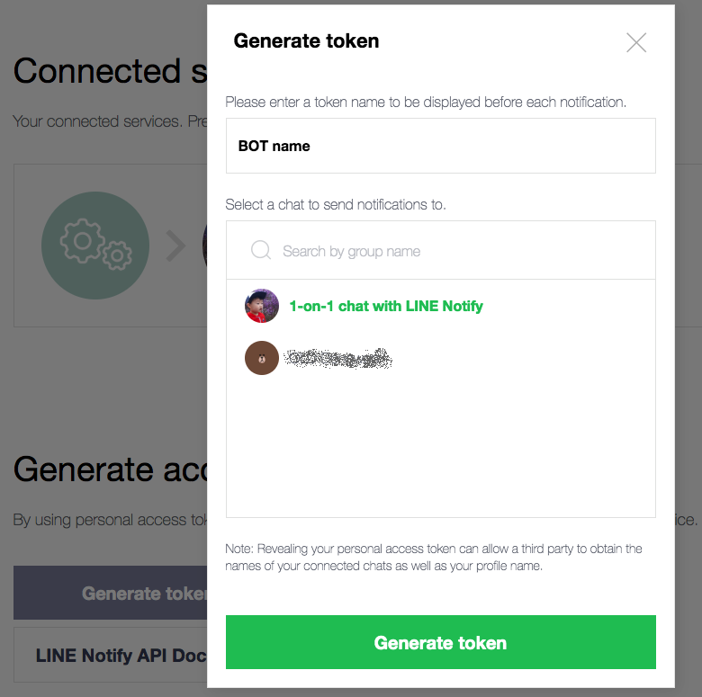
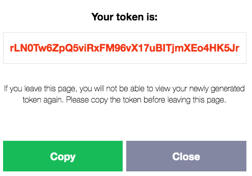
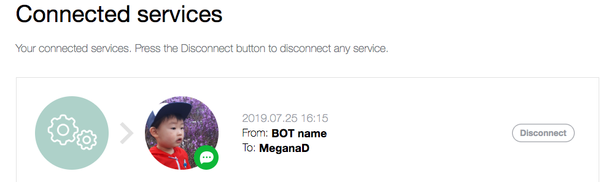
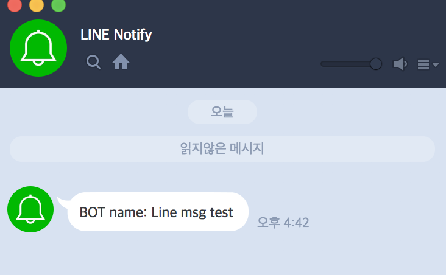

자신이 사용하는 메신저에 알림을 보내주는 서비스를 만들어 볼려고 이것저것 살펴보다가 라인으로 보내는게 꽤 편하게 되있어서 정리해 둔다.  

당연한 이야기지만 라인계정이 있어야 한다.  
공식 페이지 [LINE Notify](https://notify-bot.line.me/en/){:target="_blank"}~~(영어,일어,중국어는 있는데 한글은 없다...)~~로 가서 로그인한다.  
마이페이지로 가면 Generate token 버튼이 있다.  
메세지를 구분할 이름을 넣고 토큰을 생성한다.  
이때 메시지를 받을 대화방을 골라야 한다.  
기본적으론 1-on-1 방이 있고, 라인에서 대화방을 생성한경우 그 대화방도 선택할 수 있다.  
대화방에서 여러 사람이 같이 받을수도 있으니 여러 사용방식을 생각해볼수 있을것 같다.



토큰은 다시 확인할수 없는것 같으니 잘 복사해두자  



메세지 봇이 만들어 졌다.  



이제 [개발문서](https://notify-bot.line.me/doc/en/){:target="_blank"}를 참고해서 서비스를 만들어보자.  
POST로 ouath 토큰과 메시지를 전달해주면 알림이 간다.

node 프로젝트에서 아래처럼 구현했다.  
```javascript
router.get('/line/send_notify', async (req, res, next) => {
    const token = 'VNgzOC7xvcH6ItN3jlAuXf1pQTrsmmaPcrjs8kGMaYc';
    const msg = "Line msg test";
    try {
        axios({
            method: 'post',
            url: 'https://notify-api.line.me/api/notify',
            headers: { 
                'Content-Type' : "application/x-www-form-urlencoded",
                'Cache-Control' : "no-cache",
                'Authorization' : "Bearer " + token 
            },
            data: 'message=' + msg
          });
    } catch (error) {
        console.log(error);
    }
    res.send('message sent to line notify.');
});
```

테스트 코드를 불러보면 메시지가 온다.  
1-on-1 의 경우 LINE Notify와 대화방에 메시지가 발송된다.


~~*카카오 대비 완전 편하다*~~  
~~*카카오는 정말 짜증나게 만들어져 있어 포기. '나와의 채팅'을 써서 만들수 있겠는데 할것같은데 그럼 알림이 안간다...플친인가 그거라도 테스트해볼까 했더니 사업자번호를 넣으라네...개인개발자는 못쓰는거냐...그냥 돈내고 쓰라는건가...*~~
