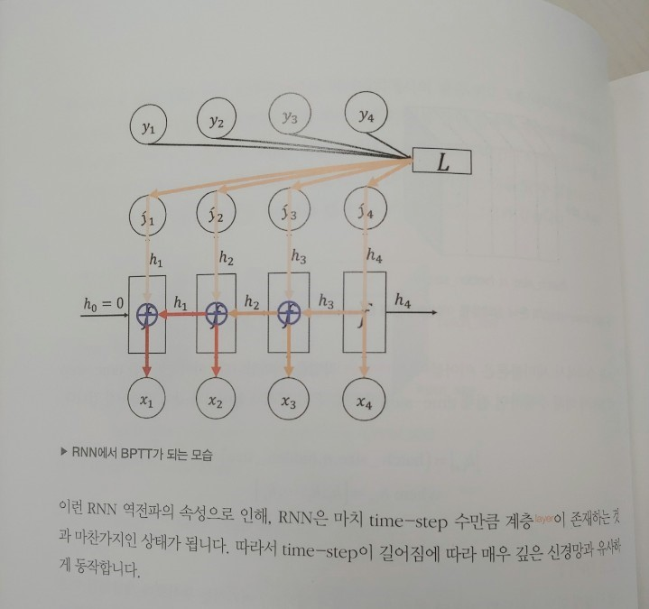
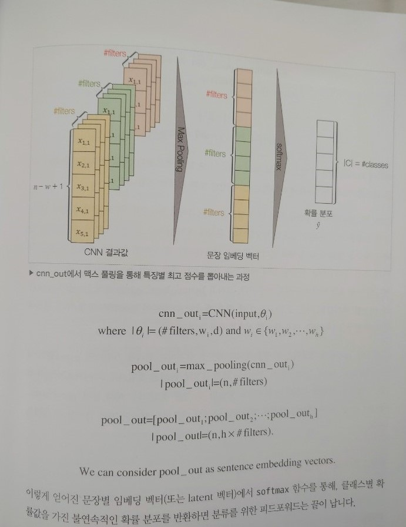

### ***책 리뷰***
>## **김기현의 자연어 처리 딥러닝 캠프**
>#### 딥러닝 기반의 자연어 처리 기초부터 심화까지 
>#### 김기현 지음 
>#### 한빛미디어  

{: width="500px"}

### ***기술의 이해에 집중한, 교과서 같은 책***

---
  
자연어 처리에 필요한 이론적인 베이스와 기술에 대해 꽤 친절하게 설명한 책이라 생각한다.  
~~(친절하다고 쉽게 이해할 수 있었다는 건 아니다.)~~

이 책의 가장 좋은 점은 우리나라 저자가 쓴 책이어서 그런지 번역서보다 좀 더 잘 읽힌다.  
그리고 또 한가지, 풀컬러! 라는 점이다.  
일반적인 프로그래밍 책이라면 컬러인쇄가 아닌, 2도 인쇄로도 충분하다고 생각한다.  
하지만 이 책의 경우 여러 가지 도표와 수식이 난무하는데 아무래도 가독성에서 차이가 난다.

{: width="500px"}
{: width="500px"}

책에 대한 총평을 해보자면, 기대햇던 것 보다는 좀 아쉬운 책이었다.  
아무래도 제목이 소문난 명강의 인 데다가 최근 핫한 키워드인 NLP와 PyTorch 에 대한 내용이다 보니 기대가 컸던 데 비해 내가 너무 못 따라간 것 같다.  
저자는 머신러닝 기초이론은 이해하고 있는 것으로 가정하고 빠르게 내용을 전개한다.  
***"딥러닝과 머신러닝 관련 개념과 이론의 기본기를 어느 정도 갖춘 독자라면 자연어 처리를 실무에 적용하는 데 필요한 지식을 이 한 권으로 체계적으로 익힐 수 있다."*** 라고 소개하고 있는데 기본기가 어느 정도 수준이냐에 따라 다가오는 느낌이 다를 것 같다.  
저자가 요구하는 선수학습은 ***"파이썬, 미적분, 선형대수, 확률통계, 머신러닝 기초이론, 딥러닝 기초이론"***이다.  

제목이 "파이토치편"이라고 되어있지만 파이토치의 비중은 크지 않다.  
실습으로서 뭔가 실제 서비스를 구현한다기 보단 이런 식으로 한다는 소개 수준이다.  
너무 많은 내용을 소개하려다 보니 소개만 하는 기분도 든다.  
책 전체가 다음처럼 진행된다. 각 토픽에 대한 배경 설명 → 이론소개 → 저자가 작성해 둔 코드를 소개 순이다.  
깃헙에 있는 코드를 그대로 책에 실어두었는데, 코드에 대한 간략한 설명이 붙어있긴 하지만 기술 소개처럼 자세하진 않고 어느 부분에 주목해라 식의 간략한 코멘트 수준이다.  
코드에 달린 주석을 참고하라는 의미라고 생각되는데 어느 정도 경험이 없다면 쉽게 이해하기 힘들 것이라 생각된다.  
책을 교재로 쓰는 강의에서 실습을 진행하고 질의·응답한다면 좋은 구성일 수 있겠으나, 이 책만 보고 공부하는 것은 나한테는 좀 버거웠다.

딥러닝을 활용한 머신러닝 기술들의 홍수 속에서 살고 있는데, 크게 보면 영상처리와 언어처리 두 가지 부류로 나눌 수 있을 것 같다.  
MNIST로 대표되는 영상처리의 경우 이미 많이 소개되다 보니 몇 번 접해보았으나, 이번 리뷰를 통해 처음으로 자연어처리에 대해 실습해 보게 되었다.  
영상처리의 경우도 쉽지 않은 내용이었지만, 자연어처리는 이것보다 더 어려웠다.  
RNN이 어떤것인지 아는 정도로는 어림도 없다는 걸 새삼 깨닫게 됐다.

