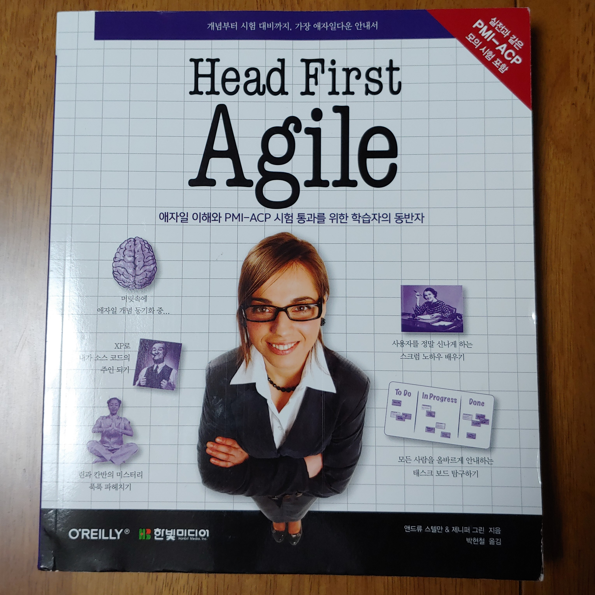
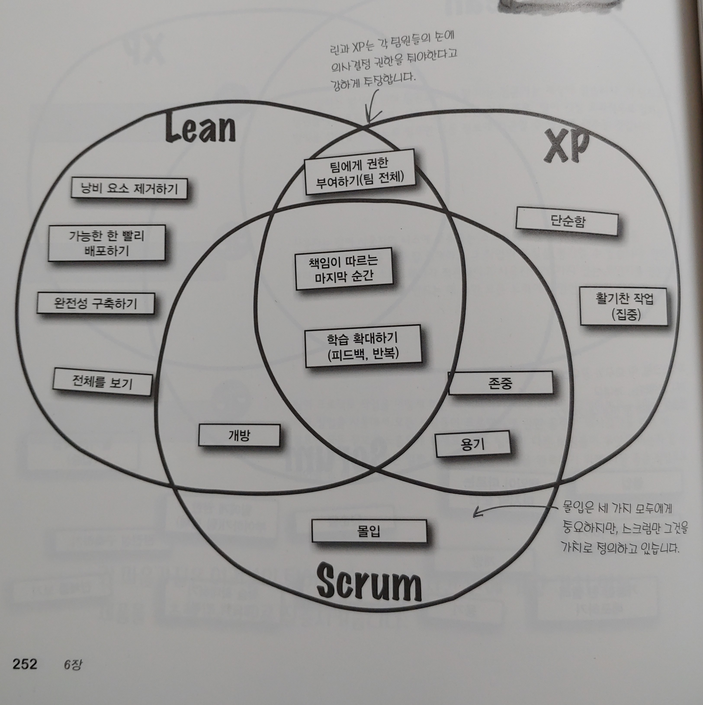

### ***책 리뷰***
>## **Head First Agile**
>#### 개념부터 시험 대비까지, 가장 애자일다운 안내서 
>#### 앤드류 스텔만, 제니퍼 그린 저/박현철 역
>#### 한빛미디어  

{: width="500px"}

### ***애자일 스러운 애자일 안내서***

---
  
우리나라에도 폭포수 방식을 벗어나서 에자일 문화를 도입한 회사가 많은 것으로 알고 있다.  
특히 데브옵스로 대변되는 클라우드 환경의 프로젝트는 애자일 방식의 개발은 필수인 것 같다.  

사실 애자일 개발이라는 개념도 꽤 오래되었다. 애자일 개발의 시초인 [애자일 소프트웨어 개발 선언](http://agilemanifesto.org/iso/ko/manifesto.html){:target="_blank"}이 2001년에 나왔으니 20년이나 된 개념이다.  
하지만 아직도 우리나라에는 ~~(폭포수 방식...이라는 탈을 쓴...)~~SI 프로젝트 방식으로 일하는 예도 많으리라 생각한다.  
부끄럽지만 나 또한 그중 한 명이다.  
최근의 스타트업이나 네이버 나 카카오 같은 IT 회사에서는 이미 애자일의 문화를 많이 수용하여 일하고 있으나, 일반 기업에서는 다소 꺼리는 경향이 있다.  
책이나 인터넷의 글들을 통해 개념은 이해하고 있지만, 이를 일상적으로 적용하지 못하다 보니 진짜로 이해하고 있는지 의심스러울 때가 많다.  
그런 나에게 아주 도움이 되는 책이었다.  

"헤드퍼스트 에자일"인 만큼 헤드퍼스트 스러운 편집과 그림, 대화체로 구성되어 있는데, 이것 또한 애자일 스럽다고 느껴졌다.  
애자일이 추구하는 ***개인과 상호작용***에 어울리는 대화체 구성이다.  
또한, 그림 등을 사용하여 최대한 이해를 돕고자 하는 부분도 ***문서보다 작동하는 소프트웨어***와 닮은 것 같다.  

국내에도 애자일을 다룬 책들이 많이 나와 있다.  
하지만 "헤드퍼스트 애자일" 처럼 XP,스크럼,린/칸반 을 아우르며 애자일 실천에 대한 안내가 된 책은 없었던 것 같다.  
각 방법론마다 다소 차이(스프린트, 스크럼마스터 같은)가 있는데, 이 차이가 왜 생겼는지 확실하게 알수 있었다.  
추구하는 바가 조금씩 다르기 때문인데, 결국 내가 처한 환경에서는 어떤 형태가 좋을지, 혹은 어떤 장점을 취할 수 있는지 생각해 볼 수 있었다.  

책에 **린, 스크럼, XP는 호환됩니다**라는 내용이 있다.  
결국 애자일에서 중요한 것은 방법론이 아닌 애자일 정신, 혹은 애자일 문화인 것이다.  
최근 IT뿐 아니라 일반 경영분야에서도 애자일 경영을 도입하여 효과를 보고 있다고 들었다.  
이미 애자일은 개발자의 전유물이 아닌 사회 문화가 되어 가고 있는 것이다.  
아직 애자일을 접해보지 않은 사람이라면 꼭 읽어보시길 바란다.  

그리고 출판사의 책 소개에 함께 읽기 권하는 책으로 Head First PMP 가 추천되어 있는데, 책의 부제인 PMI-ACP 자격 때문인 것 같다.  
개인적으로는 PMP보다는 같은 출판사에서 나온 [The Nature of Software Development](http://www.hanbit.co.kr/store/books/look.php?p_code=B2161499374){:target="_blank"}를 추천한다.  
애자일에 대해 거의 모르거나 왜 애자일이 필요한지에 대해 이해하지 못한다면 저 책을 먼저 읽어보는 것도 좋을 것이다.  