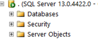

공식문서에서 특적기능을 찾아보면 몇 버전부터 지원되는지 연도형식의 버전으로 표시가 된다.  

SSMS(SQL Server Management Studio)에서 서버버전이 저런식으로 나오다보니 매번 찾아야 한다.

로컬 서버라면 HELP>About... 메뉴에서 쉽게 확인할수 있다.  
  

***원격으로 접속한 경우 SSMS와 버전이 다를수 있으니 아래표를 참고한다.***  
MSSQL 버전표 ([출처](https://sqlserverbuilds.blogspot.com/){:target="_blank"})

| Year Version        | Version         | RTM           | Latest CU                       |
|---------------------|-----------------|---------------|---------------------------------|
| SQL Server 2019     | SQL Server 15   |               |                                 |
| SQL Server 2017     | SQL Server 14   | 14.0.1000.169 | CU16 (14.0.3223.3, August 2019) |

| Year Version        | Version         | no SP        | SP1         | SP2         | SP3         | SP4          |
|---------------------|-----------------|--------------|-------------|-------------|-------------|--------------|
| SQL Server 2016     | SQL Server 13   | 13.0.1601.5  | 13.0.4001.0 | 13.0.5026.0 |             |              |
|  SQL Server 2014    | SQL Server 12   | 12.0.2000.8     | 12.0.4100.1  | 12.0.5000.0 | 12.0.6024.0 |              |
|  SQL Server 2012    | SQL Server 11   | 11.0.2100.60 | 11.0.3000.0 | 11.0.5058.0 | 11.0.6020.0 | 11.0.7001.0  |
|  SQL Server 2008 R2 | SQL Server 10.5 | 10.0.1600.22 | 10.0.2531.0 | 10.0.4000.0 | 10.0.5500.0 | 10.0.6000.29 |
|  SQL Server 2005    | SQL Server 9    | 9.0.1399.06  | 9.0.2047    | 9.0.3042    | 9.0.4035    | 9.0.5000     |
|  SQL Server 2000    | SQL Server 8    | 8.0.194      | 8.0.384     | 8.0.532     | 8.0.760     | 8.0.2039     |

 