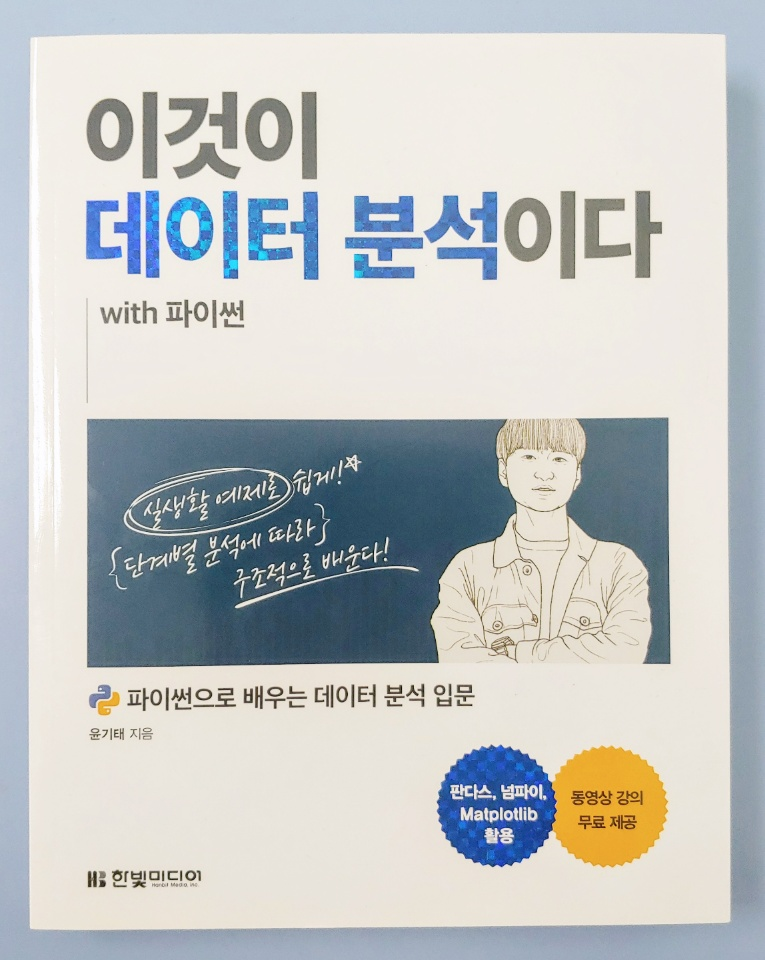
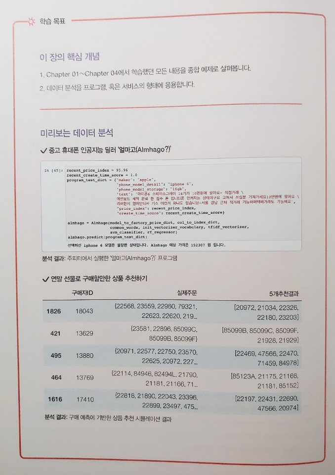
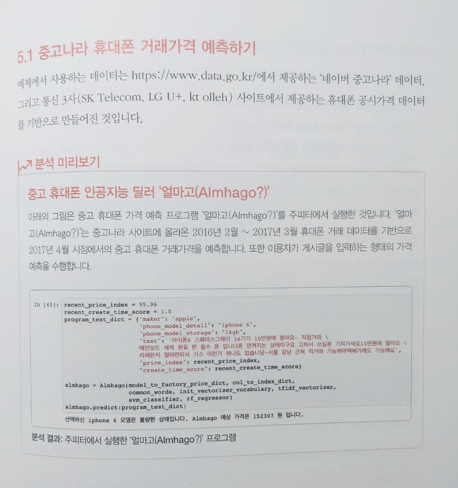

### ***책 리뷰***
>## **이것이 데이터 분석이다**
>#### 파이썬으로 배우는 데이터 분석 입문
>#### 윤기태 저
>#### 한빛미디어  

{: width="500px"}

### ***데이터 분석 입문자를 위한 탐색적 데이터 분석 실습***

---
  

데이터 분석을 해보고자 하는 초심자를 위한 책이다.  
주제를 제시하고 이를 해결해 가는 과정을 보여줌으로써 실제 데이터 분석 업무를 경험해 볼수 있도록 안내하고 있다.   
각 주제에서 데이터를 제시하고, 이를 점진적으로 개선하여 최종 분석자료를 만들어가는 일련의 과정을 배울 수 있다.  

책의 모든 소스코드 및 실행 결과가 노트북(Jupyter Notenbook)으로 제공되어 설명하고 있는 내용을 즉시 확인 할수 있다.  
또한 저자 직강 동영상 강의가 공개되어 있다.([저자의 유튜브](https://www.youtube.com/channel/UCmWjmDlmMcuZ018xIHuh3iQ){:target="_blank"}에 현재 5장까지 전부 공개 되었다.)  
이렇게 노트북으로 소스를 제공하면 독자가 단순히 실행/확인 만 하고 넘어가기 쉽습니다.  
이런 단점을 연습문제로 보완하고 있다.(물론 연습문제의 결과도 제공됩니다.)  
인터넷 강의를 들으며 따라가는 식으로 공부하고 이후 연습문제로 점검하는 방식으로 학습하기에 아주 적합하게 구성된 책입니다.
  

{: width="700px"}  
{: width="700px"}  

전체적으로 구성이나 진행면에서 나무랄데 없는 좋은 책입니다.  
다만 이론에 대한 가벼운 수준의 설명으로 진행되기에 이후 다른 책을 반드시 더 봐야한다는 점은 꼭 기억해야합니다.  
저자가 제시하는 이 책을 활용하는 방법입니다.
>본 강의는 코드를 따라 치거나, 이론적인 설명에 집중하지 않습니다.  
>입문자 입장에서 동영상을 보는 여러분께서는, 코드를 따라치는 것보다는 예제를 풀어나가는 과정을 구경하는 것을 권장드립니다.  
>예를 들어 축구하는 법을 배우고 싶을 때, 아직은 축구하는 법을 잘 모르지만 구경부터 시작하는 것과 비슷합니다.  
>축구를 하는 사람들을 구경하면서 볼을 다루는 법을 유심히 관찰한 뒤, 자신이 연습할 때 그 부분들을 신경써서 연습하는 것입니다.  

데이터 분석의 흐름을 파악하고 본격적인 데이터 과학자가 되기위한 좋은 길잡이가 되리라 생각합니다.