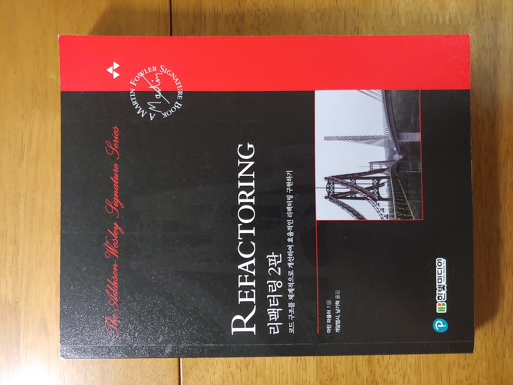
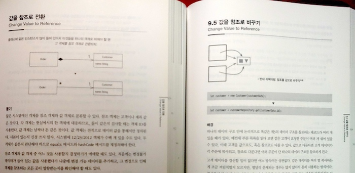
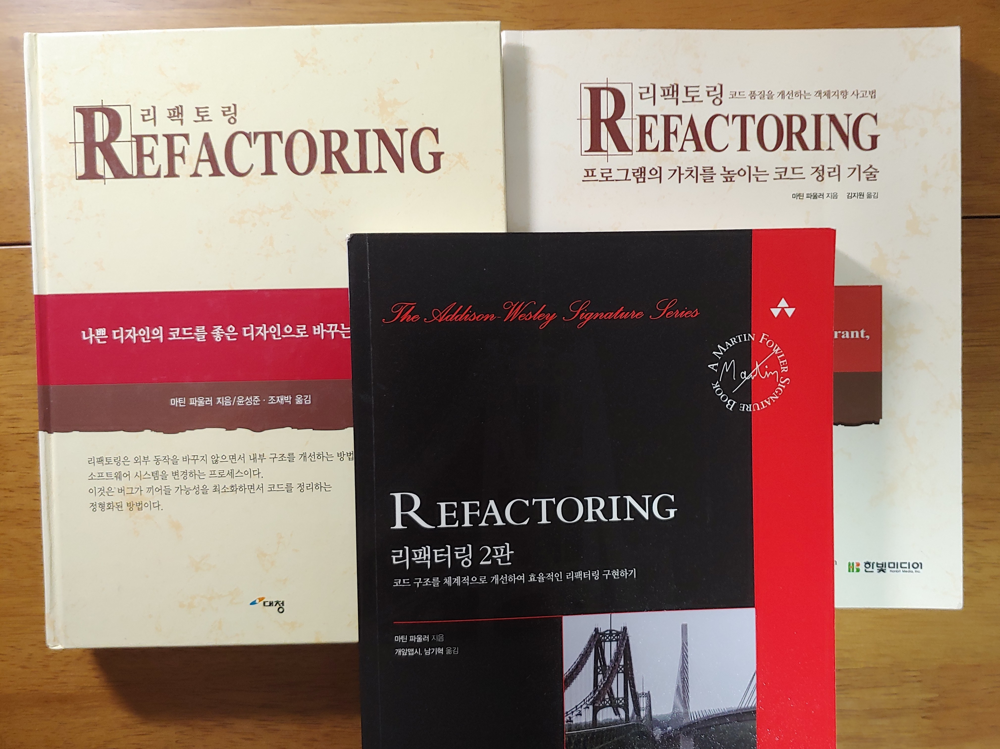
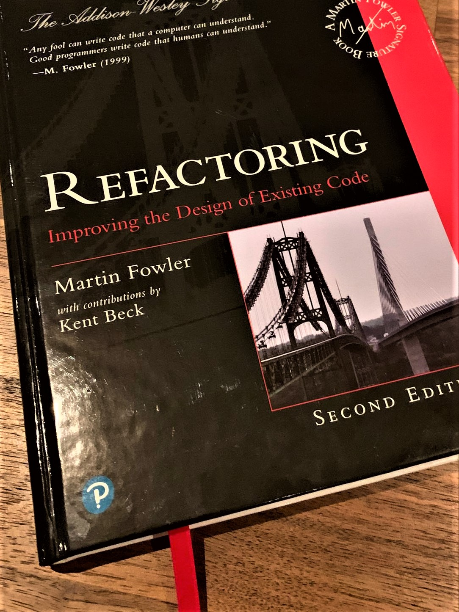

### ***책 리뷰***
>## **리팩터링 2판**
>#### 코드 구조를 체계적으로 개선하여 효율적인 리팩터링 구현하기
>#### 마틴 파울러 저/개앞맵시, 남기혁 역 
>#### 한빛미디어  

{: width="500px"}

### ***컴퓨터가 이해하는 코드는 바보도 작성할 수 있다.  사람이 이해하도록 작성하는 프로그래머가 진정한 실력자다.***

---
  
마틴파울러 리팩토링의 20년(!) 만의 개정판이다.  
그동안 프로그래머에게 필독서중 한가지로 꼽혀온 베스트셀러이다보니, 나의 평가가 필요한가 싶다...  
그래도, 기존 1판과 상당히 다른 느낌이어서 이를 위주로 살펴 보려고한다.  

  
가장 먼저 눈에 띄는 것은 제목이 "리팩토링"에서 "리팩터링"으로 변경되었다는 것이다.  
신판으로 개정되면서 바뀐 가장 큰 점은 코드가 자바스크립트로 되어있다는 점이다.  
원낙 오랫동안 C 스타일에 길들여저 있다보니 괄호 중첩이 난무하는 자바스크립트 형식을 선호하진 않는다.  
하지만, 읽다 보니 자바스크립트의 단순한 문법이 오히려 핵심적인 내용을 더 잘 보이게 하는 것 같다.
저자의 말처럼 이 책은 언어에 상관없이, 모든 프로그래머를 위한 책이였다.   
  
저자는 큰 틀에서의 변경은 없고 사소한 변경~~(정말?)~~과 17가지 새로운 리팩토링 기법을 추가했다고 한다...
>**Changes in the Second Edition**  
The changes are both very minor and all-encompassing. They are minor because the basic structure of the book hasn't changed. I begin with an opening example, a chapter of principles, a survey of "code smells", and an introduction to testing. The bulk of the book is a catalog of refactorings and of those 68 refactorings, all but 10 are still present, and I've added 17 new ones.  
*[The Second Edition of "Refactoring"](https://martinfowler.com/articles/refactoring-2nd-ed.html){:target="_blank"}*  
  
한빛미디어의 구판과 비교해보면 번역이 좀 자연스럽게 느껴졌다.  
유명한 역자분이 어서 일수도 있고, 국내에서 일반화 된 단어들이 많아져서 일수도 있겠다.  

|원문|1판|2판|
|---|---|---|
|Pull Up Field|필드 상향|필드 올리기|
|Pull Up Method|메서드 상향|메서드 올리기|
|Pull Up Constructor Body|생성자 내용 상향|생성자 본문 올리기|
|Push Down Method|메서드 하향|메서드 내리기|
|Push Down Field|필드 하향|필드 내리기|
  
용어 변경 확인 위해 3장의 목차를 비교해 보았다.
  
  
그리고 기존에는 UML로 표시한 리팩토링의 개념을 아이콘처러 표시한것이 뭔가 훨씬 보기 좋았다.
{: width="700px"}  

이미 많이 회자 된 내용이고 넓리 전파된 책이지만 신판을 구매해서 다시 볼 가치가 있다고 생각한다.  
  
  
  
다만... 아쉬운 점은...  
  
{: width="700px"}  

어쩌다보니 3가지 버전의 "리팩터링"을 가지게 되었다.  
1판의 경우 지금은 사라진 것으로 보이는 "대청미디어"의 버전과 "한빛미디어"의 버전이 있는데 개인적으로 구판(대청미디어판)을 선호 했다.  
몇 가지 이유가 있는데, 대청판은 양장이다. ㅎㅎ...  
프로그래머 생활을 하면서 듣게 되는 몇 개의 책들이 있다.  
흔히 이야기하는 "필독", "소장용"책인데, 이 리팩터링 역시 그 중 하나이다.  
개발자로 살아가야 한다면 꼭 가지고 있어야 한다고 생각하는데, 이런 소장가치가 있는 책들은 기왕이면 양장본이었으면 한다.  
우리나라 개발자의 대부분(!)은 지하철을 애용하리라 생각한다.  
책을 계속 집의 책상에서만 본다면 상관없을수도 있으나, 가방에 넣고 출퇴근 등 이동 시간동안 보는 경우도 많을 텐데 그러면 책이 상한다... 
  
{: width="700px"}  
  
양장을 하게 되면 더 무거워지고, 그러면 더 들고 다니기 힘들지 않나...  
하지만, 이책은 원래 무겁다...  
사실 별거 아닐수도 있지만, 개정판의 원서도 양장인것을 생각하면 더더욱 아쉽다...   

{: width="700px"}  

 

  

  