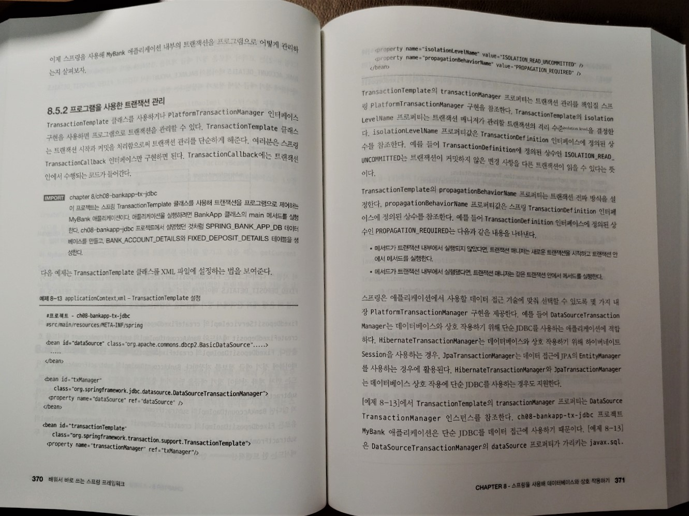
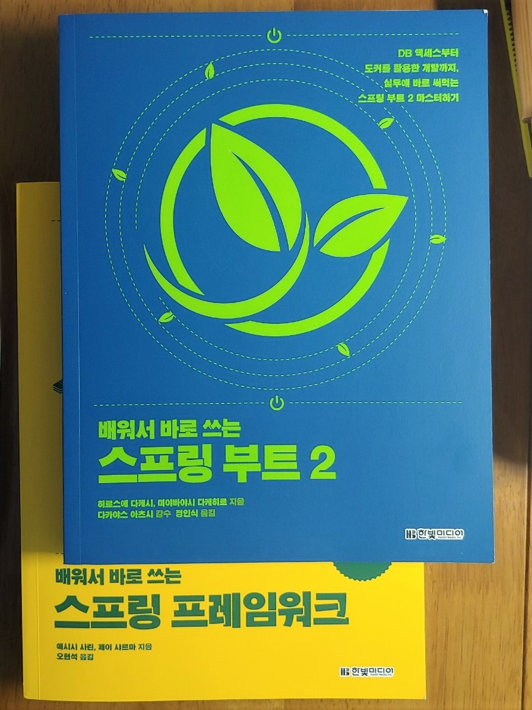

### ***책 리뷰***
>## **배워서 바로 쓰는 스프링 프레임워크**
>#### AOP, 보안, 메시징부터 스프링 웹 MVC까지 실용적인 예제로 한눈에 알아보는 스프링 가이드
>#### 애시시 사린, 제이 샤르마 저/오현석 역 
>#### 한빛미디어  

{: width="500px"}

### ***스프링 프레임워크의 개념부터 활용까지***

---
  

책 제목만 보면 초보자를 위한 책이다.   
스프링을 처음 접하는 사람을 위해 따라하기식으로 한가지씩 늘려갈것 같다.  
심지어 원서 제목은 Getting started with Spring Framework 이다.  
하지만 내가 느끼기엔 초보자를 위한 책은 아니다.  

책의 1/3정도(7장까지) 스프링 프레임워크의 기본적인 내용을 알려준다.  
인터페이스를 사용하는 프로그래밍으로 시작 해서 빈과 DI, 컨테이너 등에 대해 자세하게 설명하고 있다.  
이후 Spirng Data, MVC, AOP 등 복격적인 스프링 프레임워크의 활용에 대해서도 다루고있다.  

스프링이라는 주제 자체가 다루는 분야가 많아서 두께도 만만치 않다.(896페이지)  
또한 '흰건 종이, 검은건 글씨'라고 할만큼 빽빽한 텍스트도 인상적이다.  
(이런 엄청난 양의 텍스트를 혼자 번역했다는것도 인상적이다.)  
이런 부분들이 프로그래밍 초심자에게는 이책을 권한기 힘든 이유다.

어느정도 프로그래밍에 대한 경험이 있거나 따라하기식으로 라도 스프링을 사용해 봤다면 추천할만 하다.  
스프링의 기본적인 사항부터 차근 차근 배워나갈수 있다는 점은 매우 좋은부분이다.
(다만, 스프링의 사상과 기본 개념을 배우는 용도라면 국내에선 토비의 스프링이라는 큰 산이 있어서...)  
또한, 원서에서는 다루지 않은 Spring Boot 에 대한 내용을 역자분이 추가하셨다.  
어차피 부트를 위한 별도의 책(혹은 강의)가 필요하겠지만 이 책이 스프링의 바이블이 되겠다는 의지가 읽혔다.  

 

{: width="700px"}  
{: width="700px"}  

책의 모든 소스코드 및 실행 결과가 노트북(Jupyter Notenbook)으로 제공되어 설명하고 있는 내용을 즉시 확인 할수 있다.  
또한 저자 직강 동영상 강의가 공개되어 있다.([저자의 유튜브](https://www.youtube.com/channel/UCmWjmDlmMcuZ018xIHuh3iQ){:target="_blank"}에 현재 5장까지 전부 공개 되었다.)  

이렇게 노트북으로 소스를 제공하면 독자가 단순히 실행/확인 만 하고 넘어가기 쉽다.  
이런 단점을 연습문제로 보완하고 있다.(물론 연습문제의 결과도 제공한다.)  
인터넷 강의를 들으며 따라가는 식으로 공부하고 이후 연습문제로 점검하는 방식으로 학습하기에 아주 적합하게 구성된 책이다.  

전체적으로 구성이나 진행면에서 나무랄데 없는 좋은 책이다.  
다만, 이론에 대한 설명이 부족한 부분이 있고, 딮러닝 등 새로운 분석방법을 사용하진 않는다. 
진짜 데이터 분석가가 되고자 한다면, 깊이 있는 다른 책을 더 봐야한다는 점은 꼭 유의해야 한다.
  
  
저자가 제시하는 이 책을 활용하는 방법이다.  
>본 강의는 코드를 따라 치거나, 이론적인 설명에 집중하지 않습니다.  
>입문자 입장에서 동영상을 보는 여러분께서는, 코드를 따라치는 것보다는 예제를 풀어나가는 과정을 구경하는 것을 권장드립니다.  
>예를 들어 축구하는 법을 배우고 싶을 때, 아직은 축구하는 법을 잘 모르지만 구경부터 시작하는 것과 비슷합니다.  
>축구를 하는 사람들을 구경하면서 볼을 다루는 법을 유심히 관찰한 뒤, 자신이 연습할 때 그 부분들을 신경써서 연습하는 것입니다.  

데이터 분석을 시작하고자 하는 초심자에게 데이터 분석의 흐름을 알려주는 좋은 길잡이가 되리라 생각한다.  
  