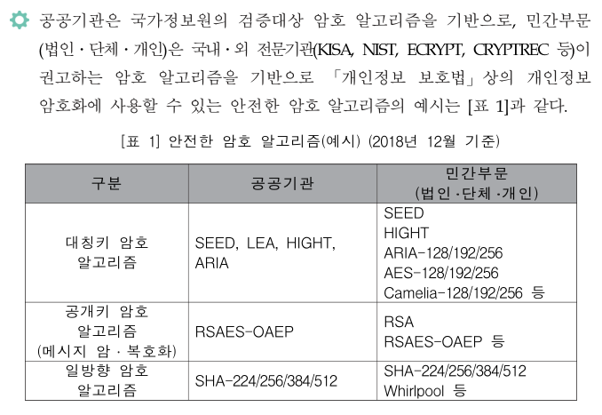

### 안전한 암호 알고리즘

「개인정보의 안전성 확보조치 기준」 및 「개인정보의 기술적&middot;관리적 보호조치 기준」에서는 개인정보처리자 및 정보통신서비스 제공자 등이 암호화 대상 개인정보를 저장&middot;전송할 경우 "안전한 암호 알고리즘"으로 암호화하도록 규정하고 있으며, "안전한 암호 알고리즘"이란 국내 및 미국, 일본, 유럽 등의 국외 암호 연구 관련 기관에서 권고하는 암호 알고리즘을 의미 한다.  

개인정보의 암호화 조치 안내서(2020.12.개정) 7p

 
 

### 국산 암호 알고리즘

- #### SEED  
  전자상거래, 금융, 무선통신 등에서 전송되는 개인정보와 같은 중요한 정보를 보호하기 위해 1999년 2월 한국인터넷진흥 원과 국내 암호전문가들이 순수 국내기술로 개발한 128비트 블록 암호 알고리즘
- #### HIGHT (HIGh security and light weigHT)  
  RFID, USN 등과 같이 저전력·경량화를 요구하는 컴퓨팅 환경에서 기밀성을 제공하기 위해 2005년 KISA, ETRI 부설연구소 및 고려대가 공동으로 개발한 64비트 블록암호 알고리즘 
- #### LEA (Lightweight Encryption Algorithm)
  빅데이터, 클라우드 등 고속 환경 및 모바일기기 등 경량 환경에서 기밀성을 제공하기 위해 개발된 128비트 블록암호 알고리즘 
- #### ARIA (Academy, Research Institute, Agency)  
  경량 환경 및 하드웨어 구현을 위해 최적화된, Involutional SPN 구조를 갖는 범용 블록 암호 알고리즘
