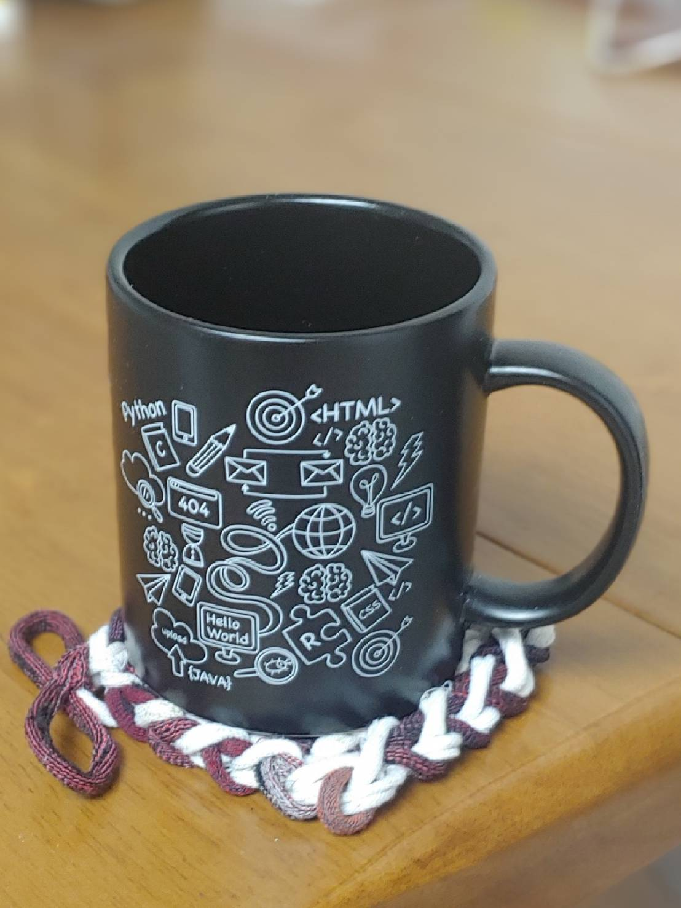
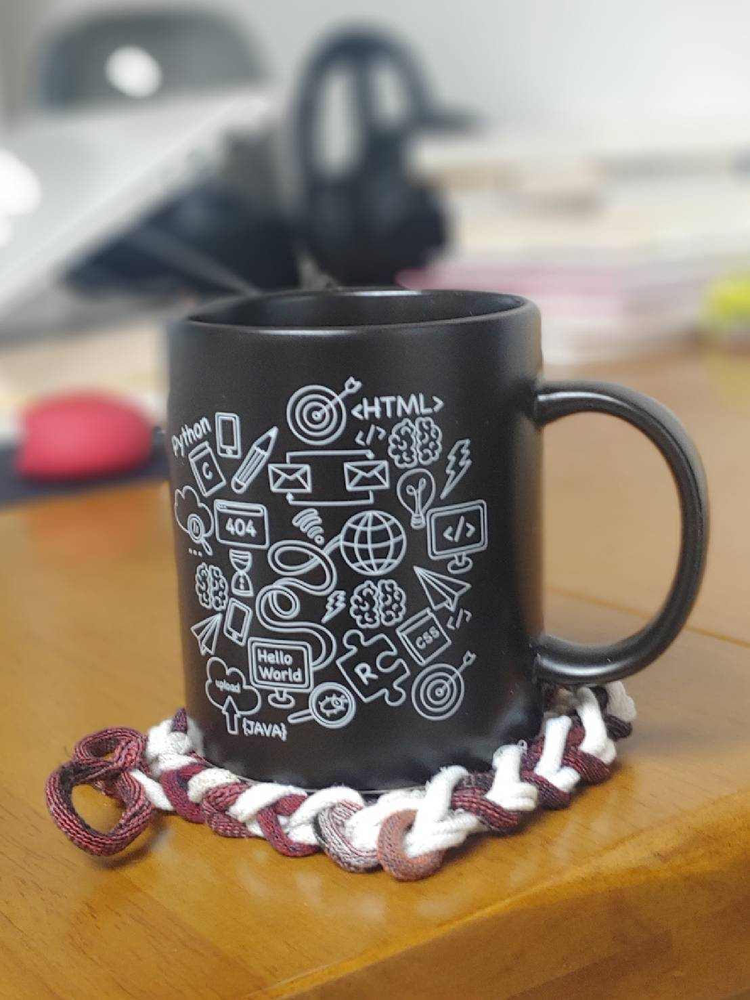
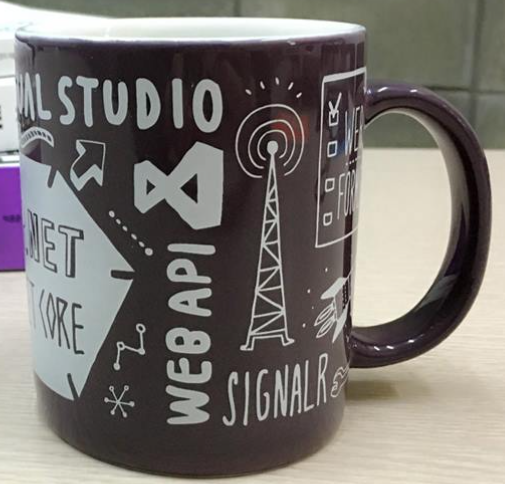

오랫만에 입수한 개발자 머그...  
{:width="300px"}
{:width="300px"}  

컵 안쪽까지 까만색이라 커피때가 안타서 좋을듯~😃  
[제이펍 출판사에서 만들었는데](https://www.facebook.com/jeipub/posts/4267240466695769){:target="_blank"} 출판사가 안 적혀 있다.  
뭐 없으면 좋지만 회사입장에선 바닦에라도 적는게 좋지 않았을까?😁

{:width="300px"}  
지금까진 [길벗 출판사에서 받은 머그](https://www.facebook.com/gbitbook/posts/675345155991935/){:target="_blank"}를 쓰고 있었는데 이제 바꿀때가 됐나보다 ㅎㅎ  
그러고보니... C#, .NET은 이때보다 저변이 더 얇아진것 같다...😭

