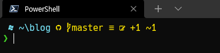

zsh의 Powerlevel10k를 쓰다보니 Powshell에서도 Powerlevel10k 쓰고 싶어졌다.  
워낙 인기가 있어서 인지 Oh My Posh의 기본 테마 중에도 Powerlevel10k 가 있다.  
zsh처럼 개인화 되진 않지만 별도 설정없이 쓸수있어 편한점도 있다.  

그런데... branch만 표시되고 status는 표시가 안된다.😑  
그래서 다른 테마를 참고하여 powerlevel10k_lean 스타일에 git status를 추가해서 쓰고 있다.  
 
  


#### 적용법:  
[Oh My Posh](https://ohmyposh.dev/docs/themes){:target="_blank"} 과 [posh-git](http://dahlbyk.github.io/posh-git/){:target="_blank"} 을 설치해야 한다.  
_(아래 코드에 설치스크립트도 포함되어 있다)_  

파워쉘에서 아래 코드를 실행한다.

```powershell
Install-Module posh-git,oh-my-posh -Scope CurrentUser
curl -o $home\powerlevel10k_lean_with_git_status.omp.json https://gist.githubusercontent.com/MeganaD/2d1a501c2eb2642303831306ca5cb385/raw
Add-Content $PROFILE "`nImport-Module posh-git, oh-my-posh`nSet-PoshPrompt -Theme ~\powerlevel10k_lean_with_git_status.omp.json"
. $PROFILE

```

깨진 글자가 표시된다면 Nerd 폰트가 설치 되지 않은 것이다.  
powerlevel10k에서 추천하는 [Meslo Nerd](https://github.com/romkatv/powerlevel10k#meslo-nerd-font-patched-for-powerlevel10k){:target="_blank"}를 받아 사용하거나, [Nerd Fonts](https://www.nerdfonts.com/font-downloads){:target="_blank"}에서 원하는 폰트를 내려받아 설치하자.  
Windows Terminal에서 [Ctrl+,]를 눌러 프로필에 설치된 폰트를 설정할 수 있다.  
  

_모든 프로필에서 폰트를 적용하려면 Json파일을 열어 직접 수정하면 된다._  


