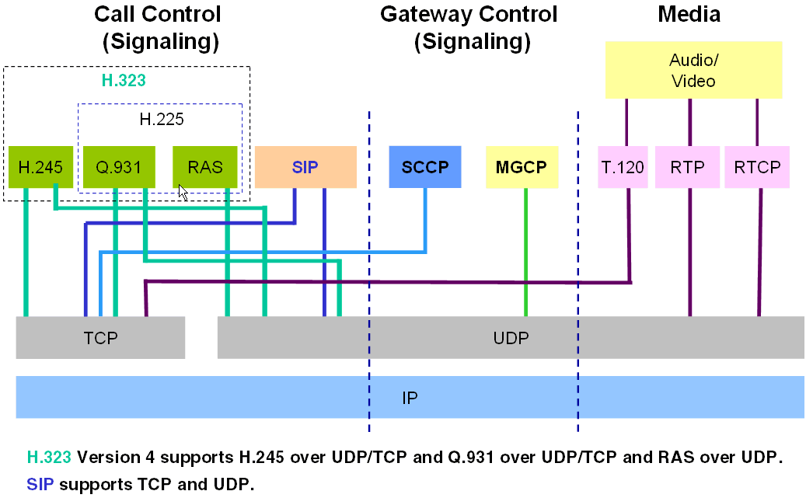
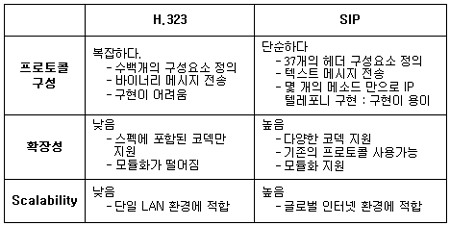

### VoIP (Voice over Internet Protocol)
- 인터넷 연결을 통한 음성 트래픽 전송
- 인터넷 또는 기타 IP 기반 네트워크를 통해 음성 대화를 라우팅하는 것
- 기존 IP 네트워크를 활용해 전화서비스를 통합 구현함으로써 전화나 팩스전송에 소요됐던 회선 비용을 크게 절감
- IP Telephony, Internet telephony, Digital Phone ...

### VoIP 기술 분류 
- **전송 기술**: 멀티미디어 데이터를 전송하는 미디어 전송기술
- **QoS 기술**: 서비스 질을 향상
- **시그널링 기술**: 세션 연결 및 관리

  
[<출처: 참고자료 4>](#ref4)

### Protocols
- #### H.323
  - ITU(International Telecommunication Union) 에서 만든 표준
  - 화상 회의용으로 설계된 포괄적이고 복잡한 프로토콜
  - 화상 회의, 데이터 공유 및 VoIP와 같은 오디오 서비스 제공
  - H.323을 실행하는 모든 장치가 독립적으로 작동하도록 하는 피어 투 피어 프로토콜  
  - 바이너리 기반
  - H.323 Protocol Suite
    - Video: H.261, H.263 ...
    - Audio: G.711, G.722, G.723.1, G.728, G.729 ... 
    - Data: T.122, T.124, T.125, T.126, T.127 ...
    - Transport: RTP, H.225, H.235, H.245, H.450.3, X.224.0 ...
  - 다양한 기술의 집합, VoIP를 위해 설계된 것은 아님

- #### SIP(Session initiation protocol)
  - **VoIP 애플리케이션을 위해 특별히 개발**된 간소화된 프로토콜
  - IETF(Internet Engineering Task Force)에서 개발한 차세대 프로토콜
  - 가볍고 확장 가능한 프로토콜이지만 H.323 대비 기능 부족
  - Endpoint 간 세션을 설정(시작, 관리, 종료)
  - 오디오/비디오 전송을 위한 것이 아니며 단지 세션을 설정함
  - 텍스트 기반(DNS, HTTPS 및 RTP와 같은 표준 활용)

  
[<출처: 참고자료 1>](#ref1)

- #### MGCP( Media Gateway Control Protocol )
  - IETF 표준
  - 엔드포인트 제어에 중점 (e.g., 통화 대기 등)
  - 중앙 집중식 구성 🡒 SPOF
- #### SCCP (Skinny client control protocol)
  - Cisco proprietary VOIP protocol

- #### RTP (Real-time Transport Protocol)
  - 인터넷을 통한 오디오/비디오 전송을 위한 표준 패킷 ​​형식을 정의
  - 미디어 관련 데이터를 실시간으로 Endpoint 간 스트리밍
  - 멀티캐스트를 통해 병렬로 여러 Endpoint로 데이터 전송 가능
  - RTP 응용 프로그램은 일반적으로 UDP 기반으로 구현
- #### RTCP (Real-time Transport Control Protocol)
  - 통화 참가자에게 제어 패킷을 보내는 데 사용
  - 전송 통계 및 서비스 품질(QoS) 모니터링 & 피드백
  - 암호화 및 인증 기능 없음 🡒 SRTP 필요
- #### SRTP (Secure Real-Time Transport Protocol)
  - RTP의 보안 확장판
  - 메시지 인증 과 무결성, 기밀성 및 재생공격 보호 등 보안 기능 추가
  - IETF RFC 3711
  - 암호: AES-CTR mode, AES-f8-mode, NULL Cipher
  - 메시지 인증: HMAC-SHA1

> _참고자료_  
 1. <a name="ref1" href="https://www.tta.or.kr/data/weekly_view.jsp?news_id=502" target="_blank">https://www.tta.or.kr/data/weekly_view.jsp?news_id=502</a>
2. [https://www.certificationkits.com/cisco-certification/ccna-voice-certification-topics-a-labs/ccna-voice-describe-voip-technologies/ccna-voice-h323-mgcp-sip-and-sccp-protocols/](https://www.certificationkits.com/cisco-certification/ccna-voice-certification-topics-a-labs/ccna-voice-describe-voip-technologies/ccna-voice-h323-mgcp-sip-and-sccp-protocols/){:target="_blank"}
3. [https://computer.howstuffworks.com/ip-telephony.htm](https://computer.howstuffworks.com/ip-telephony.htm){:target="_blank"}
4. <a name="ref4" href="https://sc1.checkpoint.com/documents/R80.10/WebAdminGuides/EN/CP_R80.10_VoIP_AdministrationGuide/html_frameset.htm?topic=documents/R80.10/WebAdminGuides/EN/CP_R80.10_VoIP_AdministrationGuide/87790" target="_blank">https://sc1.checkpoint.com/documents/R80.10/WebAdminGuides/EN/CP_R80.10_VoIP_AdministrationGuide/html_frameset.htm?topic=documents/R80.10/WebAdminGuides/EN/CP_R80.10_VoIP_AdministrationGuide/87790</a>
5. [https://en.wikipedia.org/wiki/Secure_Real-time_Transport_Protocol](https://en.wikipedia.org/wiki/Secure_Real-time_Transport_Protocol){:target="_blank"}
6. [https://datatracker.ietf.org/doc/rfc3711/](https://datatracker.ietf.org/doc/rfc3711/){:target="_blank"}

