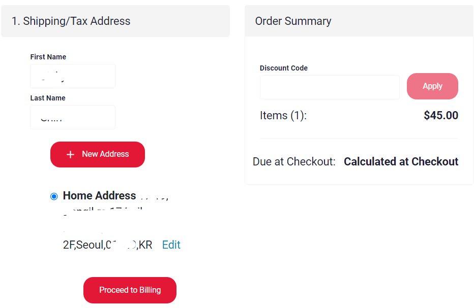
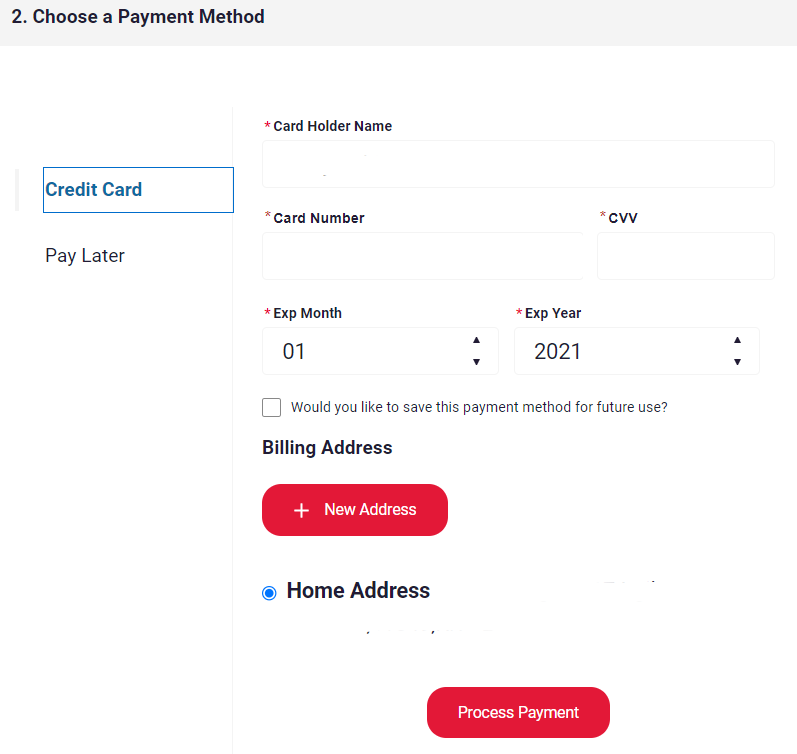
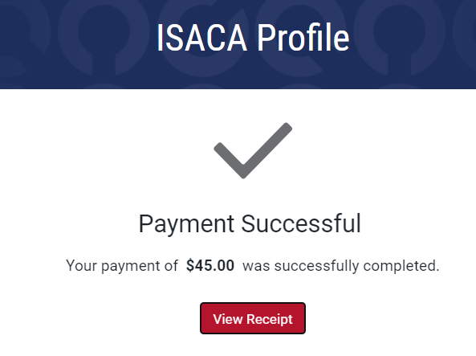

CISA 갱신하라는 메일이 왔다.  

뭐 갱신과정은 별거 없었다.  
다만, 참고할건 시험 볼때 회원가입하고 시험을 보는 쪽이 유리하다는 점이다.  

처음 시험 접수할 때, 가입하지 않는쪽이 비용적으로 조금 싸다.  
(비회원:$760, 회원:$575+$210(가입비) = $785)  
그래서 단번에 붙을 자신이 있다면 굳이 가입하지 않고 $25을 아낄수 있다고 생각했는데...  

회원과 비회원이 갱신비용이 다르다.   
[회원은 $45, 비회원은 $85](https://www.isaca.org/credentialing/cisa/maintain-cisa-certification){:target="_blank"} 이다.  
그런데 올해 시험볼때 가입했으니 올해는 회원대상 갱신비용으로 갱신이 가능했다!  
갱신비에서 $40를 아낄수 있으니 이쪽이 더 이득이다!!!😲

~~[참고로 12월 15일까지 한달 동안 시험비 15%할인 한다.](https://www.isaca.org/go/flash){:target="_blank"}~~ ~~종료~~  
~~_난 다주고 했는뎅 😭_~~  

  
~~매년 하는 듯~~  

