### ● 클라우드 보안인증제
- 정보보호 기준의 준수여부 확인을 인증기관에 요청하는 경우 인증기관이 평가·인증하여 이용자들이 안심하고 클라우드 서비스를 이용할 수 있도록 지원하는 제도
- 「클라우드컴퓨팅 발전 및 이용자 보호에 관한 법률」(약칭:클라우드컴퓨팅법) 제5조에 따른 "기본계획"(2015년 12월 7일 확정, 정보통신전략위원회) 상의 "보안인증제" 시행

<!---
> #### 클라우드컴퓨팅 발전 및 이용자 보호에 관한 법률 ( 약칭: 클라우드컴퓨팅법 )  
> 제23조(신뢰성 향상) ② 과학기술정보통신부장관은 클라우드컴퓨팅서비스의 품질ㆍ성능에 관한 기준 및 정보보호에 관한 기준(관리적ㆍ물리적ㆍ기술적 보호조치를 포함한다. 이하 “보안인증기준”이라 한다)을 정하여 고시하고, 클라우드컴퓨팅서비스 제공자에게 그 기준을 지킬 것을 권고할 수 있다. <개정 2017. 7. 26., 2022. 1. 11.>  
>[시행일: 2023. 1. 12.]
--->

#### § 정의
1. 클라우드컴퓨팅(Cloud Computing) [법 제2조]
  - 집적ㆍ공유된 정보통신기기, 정보통신설비, 소프트웨어 등 정보통신자원을 이용자의 요구나 수요 변화에 따라 정보통신망을 통하여 신축적으로 이용할 수 있도록 하는 정보처리체계
2. 클라우드컴퓨팅기술 [시행령 제2조]
  - 집적ㆍ공유된 정보통신기기, 정보통신설비, 소프트웨어 등 정보통신자원(이하 “정보통신자원”이라 한다)을 가상으로 결합하거나 분할하여 사용하게 하는 기술
  - 대량의 정보를 복수의 정보통신자원으로 분산하여 처리하는 기술
  - 그 밖에 정보통신자원의 배치와 관리 등을 자동화하는 기술 등 클라우드컴퓨팅의 구축 및 이용에 관한 정보통신자원을 활용하는 기술
3. 클라우드컴퓨팅서비스 [시행령 제3조]
  - 클라우드컴퓨팅을 활용하여 **상용(商用)**으로 타인에게 정보통신자원을 제공하는 서비스
    1. 서버, 저장장치, 네트워크 등을 제공하는 서비스
    2. 응용프로그램 등 소프트웨어를 제공하는 서비스
    3. 응용프로그램 등 소프트웨어의 개발ㆍ배포ㆍ운영ㆍ관리 등을 위한 환경을 제공하는 서비스
    4. 그 밖에 제1호부터 제3호까지의 서비스를 둘 이상 복합하는 서비스

#### § 인증 종류
- **IaaS / SaaS(표준,간편) / DaaS** 
  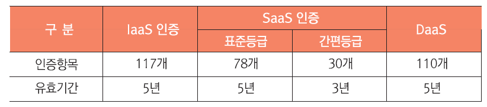

#### § 평가 종류
- #### 최초평가
  - 보안인증을 처음으로 취득할 때 진행
  - **5년(SaaS 간편등급은 3년)**의 유효기간 부여
  -  인증위원회 심의/의결 
- #### 상시평가: 
  - 인증 취득기간 중 **중요한 변경이 있을 경우** 변경 사항에 대해 평가
  - 서비스 기능추가, 계약 변경등 서비스의 형상변경이 발생한 경우 변경된 서비스의 보안점검 및 인증 법위 재조정
  - **인증 유효기간의 변화 없음**
- #### 사후평가: 
  - 보안인증을 취득한 이후 지속적으로 클라우드서비스 보안 평가·인증 기준을 준수하고 있는지 확인하기 위한 평가
  - 인증 유효기간(3~5년) 안에 매년 시행
- #### 갱신평가: 
  - 보안인증 유효기간 만료 전 인증의 연장을 위한 평가
  - 갱신평가 통과 시, 3~5년의 유효기간을 다시 부여
  - 유효기간 만료 시 인증 효력 상실
  - 인증위원회 심의/의결 

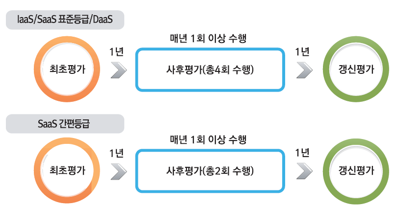

#### § 평가·인증 대상
- 신청대상:
  - 클라우드컴퓨팅법 제20조(공공기관의 클라우드컴퓨팅서비스 이용 촉진)에 따라 **공공기관의 업무를 위하여 클라우드서비스를 제공**하려는 자
- 평가·인증 대상:
  - 클라우트컴퓨팅 기술을 이용하여 정보시스템의 인프라, 응용프로그램, 개발 환경 중 어느 하나 이상을 제공하는 클라우드서비스
  - 클라우드서비에 포함되거나 관련있는 자산,조직, 지원서비스 등이 모두 포함
    - 준비단계(사전컨설팅)를 통해 최종 평가 범위 결정
- 인증 불필요 유형
  - 단일 기관만을 위해 구축되는 Parivate 클라우드 환경의 서비스
  - 단순 설치형 SW 형태의 SaaS 등  

#### § 클라우드서비스 유형 별 평가
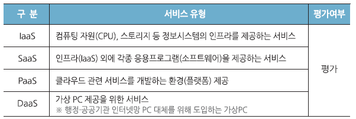
- #### IaaS 인증
  - 서버, 스토리지, 네트워크 등의 물리적이 IT인프라를 직접 구축하지 않고, 해당 자원을 사용량 기반으로 이용하는 서비스
  - IaaS 사업자의 관리 책임: 데이터센터, HW, 하이퍼바이저, HostOS, NativeOS
  - 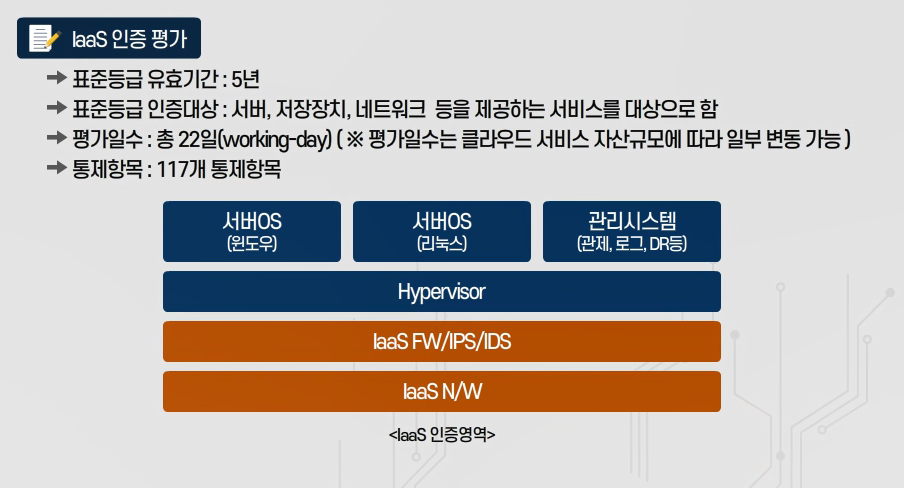
- #### SaaS 인증
  - 직접 구축하지 않고 기 구축된 SW 및 어플리케이션 만을 이용하는 서비스
  - 표준등급 대상
    - **전자결재, 인사, 회계, 보안, PaaS** 등 중요 데이터를 다루는 SaaS 서비스
  - 간편등급 대상
    - 표준등급 대상 이외의 SaaS 서비스
    - 서비스사업자가 표준/간편 중 선택 신청
  - 국공립 학교에서 학생들의 교육 목적으로 이용하려는 경우 SaaS 인증 불필요
  - 보안서비스(SECaaS)
    - 클라우드를 통한 보안서비스
    - 정보보호 제품 유형에 따른 도입요건 검토 필요 

  - 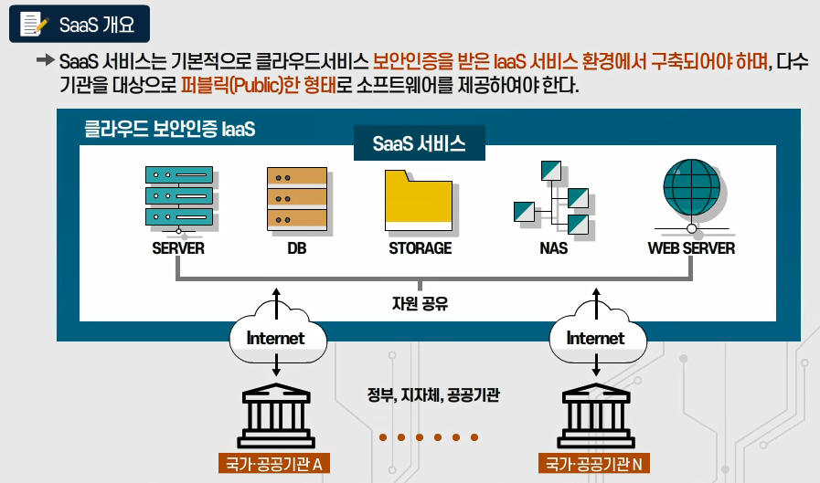
- #### DaaS 인증
  - **데스크톱 구현**에 필요한 OS를 비롯하여 각종 업무용 SW등을 클라우드 형식으로 제공하는 시스템
    - DaaS 서비스는 인프라 영역에 구성되어야 한다
  - 필수 보안요건: 
    - 가상자원 초기화, DaaS 필수 SW 설치, 비인가 접속단말 차단, 접속구간 암호화 등
  - 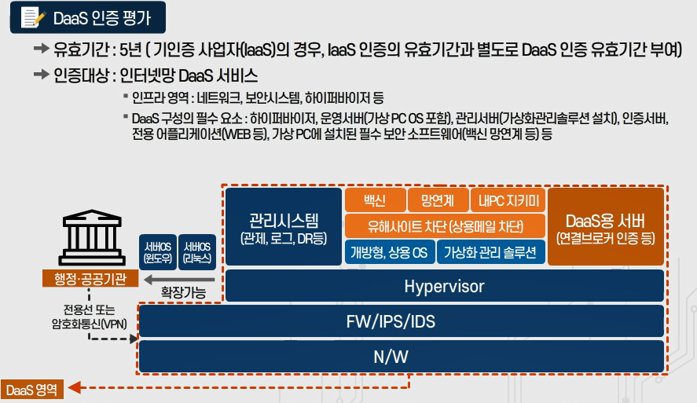
- 인증기준 요약
  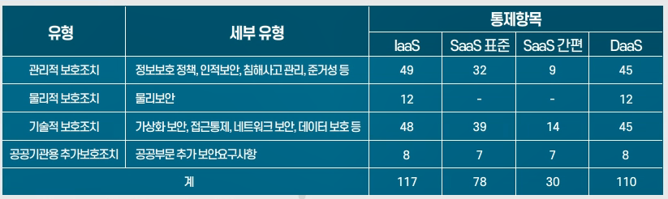

#### § 평가·인증 절차
- 클라우드서비스 보안 평가·인증 절차
  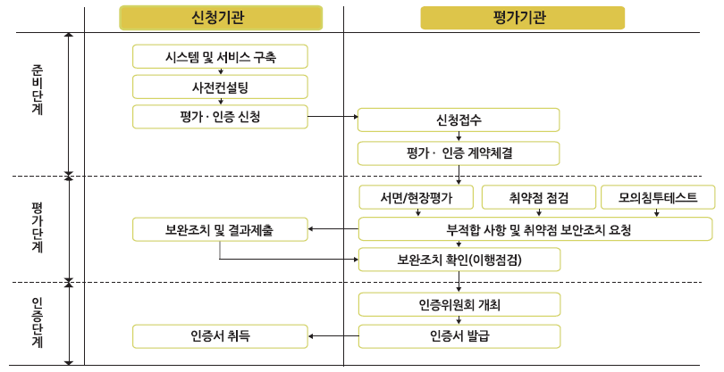  
  _상기 절차는 최초평가를 기준으로 하였으며, 1년 단위로 실시하는 사후평가에서는 평가·인증신청 단계부터 수행_
- 주요 평가단계별 소요일수
  - IaaS (총22일):
    - 사전컨설팅 2일 → 서면/현장평가(5일)·취약점점검(10일) (동시진행) 10일 → 모의침투테스트 5일 → 이행점검 5일
  - SaaS 표준등급(총17일): 
    - 사전컨설팅 2일 → 서면/현장평가(5일)·취약점점검(5일) (동시진행) 5일 → 모의침투테스트 5일 → 이행점검 5일
  - SaaS 간편등급(총14일):
    - 사전컨설팅 2일 → 서면/현장평가(4일)·취약점점검(4일) (동시진행) 4일 → 모의침투테스트 5일 → 이행점검 3일
  - DaaS (총19일): 
    - 사전컨설팅 2일 → 서면/현장평가(5일)·취약점점검(7일) (동시진행) 7일 → 모의침투테스트 5일 → 이행점검 5일
  - _※평가단계별 소요일수는 클라우드서비스 자산 규모에 따라 일부 변동 될 수 있음_

#### § 평가 단계
- 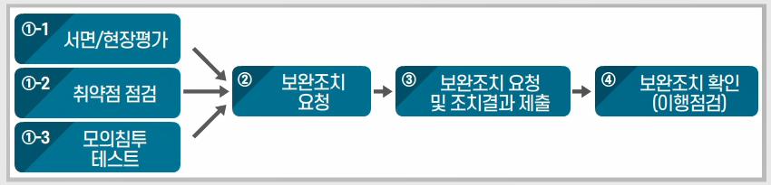
- 서면/현장평가
  - 정책, 지침, 절차 등 내부규정 존재 여부 및 해당 규정이 평가·인증 기준을 충족하는지 평가
  - 서면평가 결과과 관리/물리/기술적 보호대책 이행여부 확인
  - 도출된 문제점에 대해 부적합 보고서 작성, 신청기관과 적절성 협의
- 취약점 점검
  - CCE, CVE, SW 보안약점 진단
  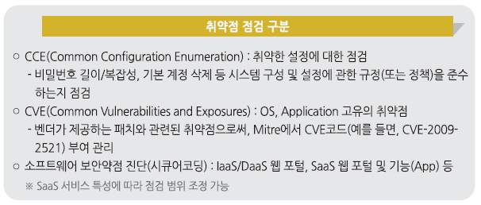
- 모의 침투 테스트
  - IaaS, DaaS: 외부 경로를 통한 PT
  - DaaS: IaaS에 포함되지 않은 부분만 PT 가능
  - SaaS: 침투시나리오 바탕 PT
- 보완조치 및 조치결과 제출
  - 보완요청을 받은 날로 부터 **30일 이내 보완조치** 완료 후 보완조치 내역서 제출  
    (필요시 공문을 통해 **최대 60일 이내 추가 연장** 가능)

#### § 사후 평가
- 서면/현장 평가
  - 이행증적 중심으로 점검 (증적 미흡 또는 미존재 시 절차확인)
- CCE 점검
  - 기존 자산 **1/4 샘플링 & 신규자산** 전수 점검
- CVE 점검
  - 제외. 반기별 사후관리 증적으로 대체
- 소스코드 점검: 최초와 동일
- 모의침투: 최초와 동일(5일)

#### § 사후 관리
- 인증취득기관의 지속적 보안수준 유지를 위해 분기마다 자체적인 보안활동 결과를 제출하고 이를 평가/확인
  - 분기별: 자산 및 기능 변경내역, 지원서비스 목록 응
  - 반기별: 자체 취약점점검(CVE) 결과 등
- 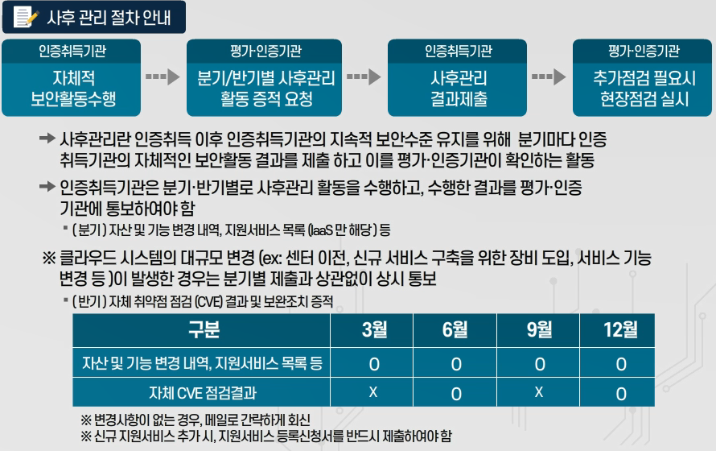

#### § 평가·인증 체계
- 정책기관: 과학기술정보통신부
- 평가/인증기관: 한국인터넷진흥원
- 기술자문기관: 국가보안기술연구소

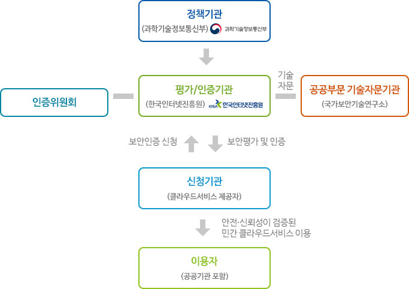

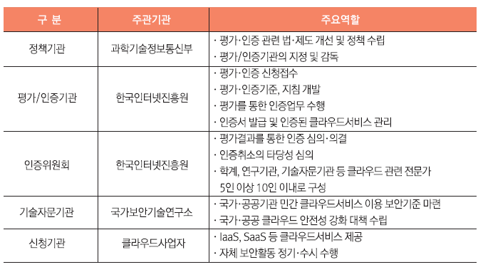

#### § 기타 사항
- 메일서비스 제공관련 필수 구현 보안요구사항
  - SPF(Sender Policy Framework), DKIM(Domain Keys Identified Mail), DMARC(Domain-based Message Authentication, Reporting & Conformance) 적용 등
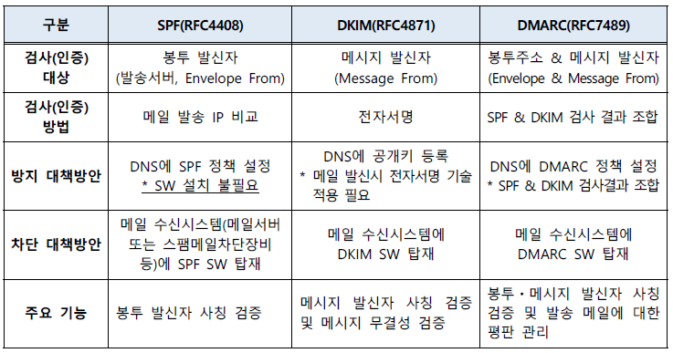

- 화상회의 서비스 제공관련 필수 구현 보안요구사항
  - 소통구간 암호화(VPN, HTTPS 등)를 통한 서비스 접근
  - 대기실 기능
  - 자료저장시 암호화
    - 접근제어, 위변조, 데이터 암호화 등 데이터 처리에 대한 보호기능 마련 필요

- 보안적합성 검증제도(CC인증, 보안기능 확인서)
  - 정보보호 제품, 네트워크 장비 등에 대해 CC인증 및 보안기능 확인서 발급 여부 확인
  - 서비스 목적으로 도입되는 정보통신제품에 대한 사전인증 여부를 확인하지 않음

>참고자료 및 이미지 출처
>- [KISA 클라우드 인증제 안내 페이지](https://isms.kisa.or.kr/main/csap/intro/){:target="_blank"}
>- 클라우드서비스 보안인증제 안내서(2020.11)
>- 사업자 대상 클라우드서비스 보안인증 교육(2021.06)
>- 클라우드서비스 보안인증제 운영 변경관리서(2021.12)