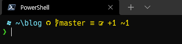

  
이런식으로 쓰고 있었는데...  
새 컴퓨터가 생겨서 파워쉘을 설치하고 기존방식대로 Oh My Posh를 설치 하려니 안된다.
변경된 설치방법으로 다시 설치해 보자.  
_[참고](https://ohmyposh.dev/docs/migrating){:target="_blank"}_ 

 


#### 적용법:  

Oh My Posh를 설치하고, $PROFILE에 원하는 테마을 지정하면 된다.  
파워쉘에서 아래 코드를 실행한다.  

```powershell
winget install oh-my-posh
curl -o $home\powerlevel10k_lean_with_git_status.omp.json https://gist.githubusercontent.com/MeganaD/2d1a501c2eb2642303831306ca5cb385/raw
Add-Content $PROFILE "`noh-my-posh init pwsh --config ~/powerlevel10k_lean_with_git_status.omp.json | Invoke-Expression"
. $PROFILE

```


혹시 winget 으로 설치되지 않으면 아래처럼 수동으로 설치할수 있다.  
```Set-ExecutionPolicy Bypass -Scope Process -Force; Invoke-Expression ((New-Object System.Net.WebClient).DownloadString('https://ohmyposh.dev/install.ps1'))```  
설치후 omp.json 파일을 $PROFILE에 등록하면 된다.  

깨진 글자가 표시된다면 Nerd 폰트가 설치 되지 않은 것이다.  
powerlevel10k에서 추천하는 [Meslo Nerd](https://github.com/romkatv/powerlevel10k#meslo-nerd-font-patched-for-powerlevel10k){:target="_blank"}를 받아 사용하거나, [Nerd Fonts](https://www.nerdfonts.com/font-downloads){:target="_blank"}에서 원하는 폰트를 내려받아 설치하자.  


#### Install-Module oh-my-posh 을 수행한 경우 삭제방법

혹시 이미 설치했다면 관련 설치파일 삭제후 적용하자.   

```powershell
Remove-Item $env:POSH_PATH -Force -Recurse
Uninstall-Module oh-my-posh -AllVersions
``` 

삭제후 $PROFILE 에서 `Import-Module oh-my-posh`을 삭제한다.  
`,`로 여러개를 임포트하고 있다면 `oh-my-posh`만 삭제하면 된다.  
기존 사용 테마 관련하여 `Set-PoshPrompt -Theme ...` 부분이 있다면  삭제한다.  